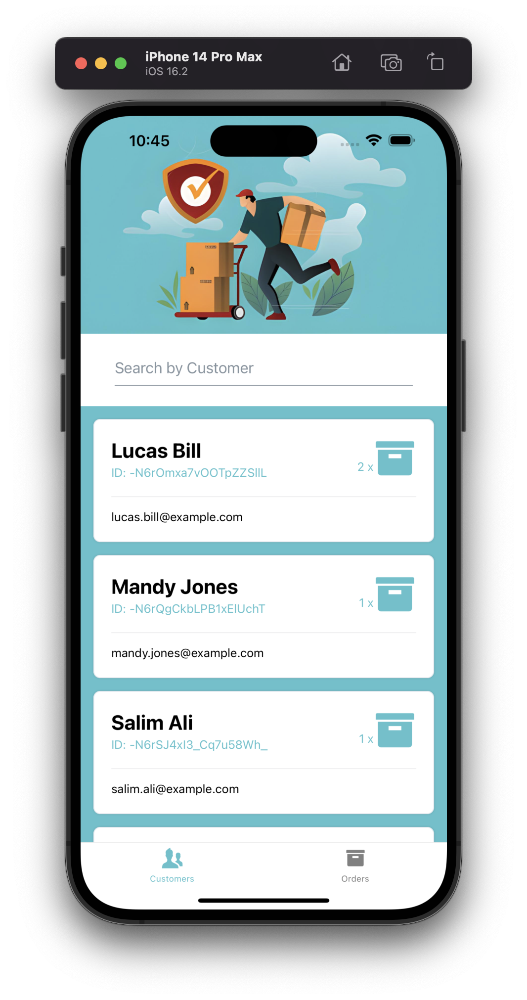
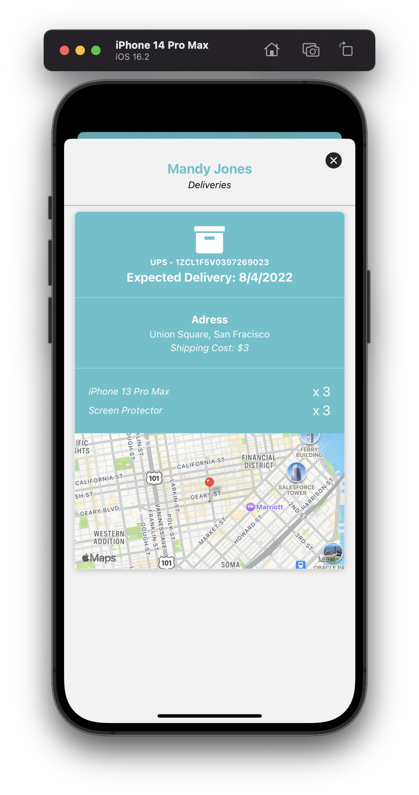
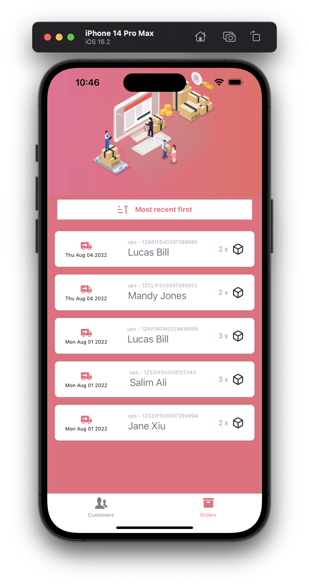
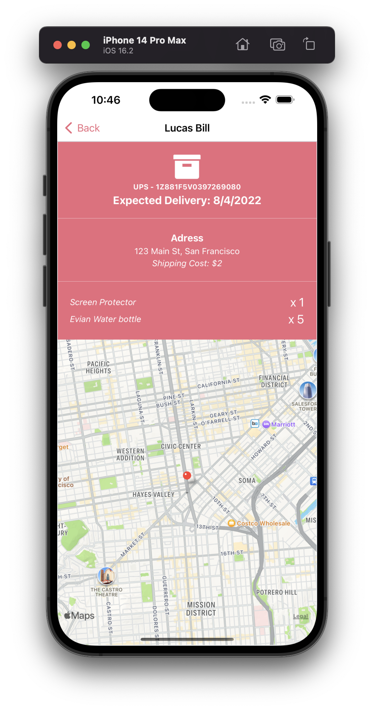

## Ups clone with `React-Native` + `@apollo/client` + `GraphQL` 🚚

### Technologies ✨

- `React-Native`
- `Expo`
- `Typescript`
- TailwindCss with `nativewind`
- `@react-navigation/bottom-tabs` and `@react-navigation/native-stack`
- `react-native-maps`
- `@apollo/client`
- `GraphQL` with `stepzen`

### Screenshots & video 🌃

<video scr="https://github.com/ng-ha/ups/assets/115610452/4b55721d-10d3-40a8-938e-acebb8ccef79" width="360px"></video>

### License :right_anger_bubble:

[MIT](https://choosealicense.com/licenses/mit/)
